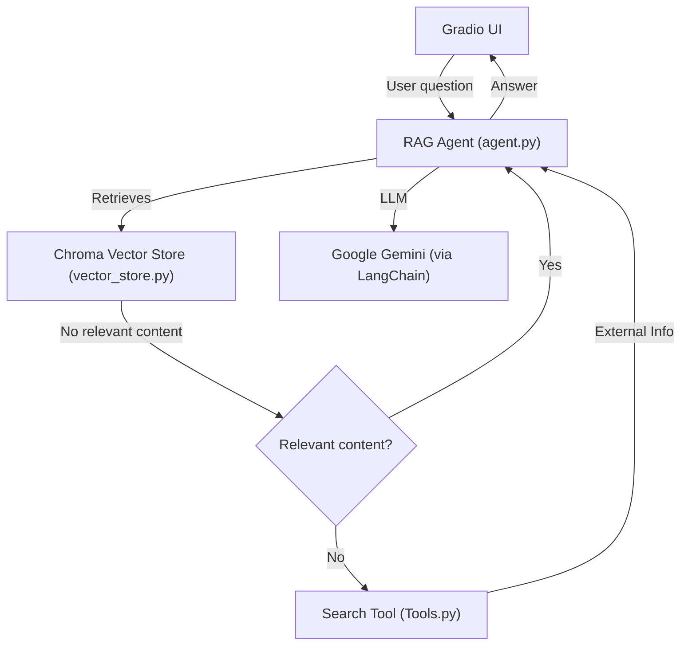

# Agentic RAG

Note:
``` I have paraphrased and polished the readme.md using Generative AI ```

A Retrieval-Augmented Generation (RAG) chatbot with agentic workflow, powered by Google Gemini and LangChain, featuring a Gradio UI and vector database for document retrieval.

---

## Features
- **Agentic RAG pipeline**: Modular planner, retriever, and generator nodes
- **Document ingestion**: Supports PDF, DOCX, and TXT files
- **Vector store**: Uses ChromaDB with Google Generative AI embeddings
- **Gradio UI**: Chat interface for user interaction
- **Configurable**: All settings via `config.json`

---

## Setup

### 1. Clone the repository
```bash
git clone https://github.com/sujith2303/AgenticRAG.git
cd Agentic-RAG
```

### 2. Install dependencies
> **Note:** Fill in your API keys in `config.json` before running.

```bash
pip install -r requirements.txt
```

### 3. Configure
Edit `config.json` and set:
- `GOOGLE_API_KEY` (required)
- `LANGSMITH_API_KEY` (optional, for tracing)
- Other parameters as needed

---

## Usage

### 1. Create the Vector Database
Add your documents (PDF, DOCX, TXT) to a folder, then run:

```bash
python src/create_database.py
```
> Add files inside `database_pdfs` and run the above bash command.

### 2. Launch the UI
```bash
python src/ui.py
```
The Gradio chat interface will open in your browser.

---

## Architecture
> **Note:** I have created this architecture using Generative AI


- **ui.py**: Gradio chat interface, connects to the agent
- **agent.py**: Orchestrates planner, retriever, and generator nodes
- **vector_store.py**: Handles document loading, splitting, and vector storage
- **create_database.py**: Loads documents into the vector store
- **config.py/config.json**: Centralized configuration

---

## Local Deployment

1. Install Python 3.8+
2. Install dependencies: `pip install -r requirements.txt`
3. Configure `config.json`
4. Create the database: `python src/create_database.py`
5. Launch the UI: `python src/ui.py`

---

## Docker Deployment

### 1. Build the Docker image
```bash
docker build -t agentic-rag .
```

### 2. Run with Docker Compose

#### docker-compose.yml
```yaml
version: '3.8'
services:
  agentic-rag:
    build: .
    ports:
      - "7860:7860"
    volumes:
      - ./config.json:/app/config.json
      - ./data:/app/data
    environment:
      - GOOGLE_API_KEY=<your-google-api-key>
      - LANGSMITH_API_KEY=<your-langsmith-api-key>
```

#### Start the service
```bash
docker-compose up --build
```

The Gradio UI will be available at [http://localhost:7860](http://localhost:7860)

---

## Notes
- Ensure your API keys are set in `config.json` or as environment variables.
- To add new documents, add into the database_pdfs and run src/create_database.py

---

## Results

### GeneralQuestions 


---

### Chatbot without RAG


---

### Chatbot with RAG


---

### Chatbot with History


---

### Chatbot with RAG and No Google Search


---

### Chatbot with RAG and Google Serach


### LangGraph Architecture


---
